# OPNsense NetFlow Traffic Analysis Lab

A hands-on cybersecurity lab built using Hyper-V and OPNsense to explore traffic monitoring, baseline analysis, performance observation, and IDS verification in a virtual environment.

This lab demonstrates how to use NetFlow and Traffic Graph in OPNsense to observe network activity, compare normal traffic with increased traffic, and verify IDS functionality through controlled testing.

---

## Lab Overview

This lab simulates a small internal network monitored by OPNsense.

Components:

- Hyper-V virtualization
- OPNsense firewall/router
- Windows Server
- Windows 11 client

---

## Network Topology

                INTERNET
                    |
               [ WAN - hn0 ]
                    |
             +----------------+
             |    OPNsense    |
             | Firewall/Router|
             +--------+-------+
                      |
                [ LAN - hn1 ]
                      |
               +---------------+
               |   LAN-Switch   |
               +-------+--------+
                       |
          +------------+------------+
          |                         |
  Windows Server               Windows 11
  192.168.10.145              192.168.10.144
  GW: 192.168.10.1            GW: 192.168.10.1

---

## Network Design

| Network | Subnet | Gateway | Purpose |
|--------|--------|---------|---------|
| LAN | 192.168.10.0/24 | 192.168.10.1 | Main internal lab network |

---

## Key Features

- NetFlow setup in OPNsense
- Traffic monitoring with Reporting > Traffic
- Baseline traffic observation
- Increased traffic testing between client and server
- IDS setup using Intrusion Detection
- User defined IDS test rule
- Suricata log verification
- Hyper-V lab troubleshooting and traffic behavior analysis

---

## Security Concept

This lab demonstrates two main monitoring layers:

- NetFlow and Traffic Graph help observe traffic patterns and bandwidth activity
- IDS helps detect traffic that matches active rules and generates alerts

The lab also shows an important practical detail: traffic inside the same LAN does not always pass through OPNsense in the way first expected for inspection and alerting. Because of that, controlled testing directly toward OPNsense was used to verify IDS functionality more clearly.

---

## Configuration Summary

### NetFlow / Traffic

- Configured NetFlow on the LAN interface
- Opened Reporting > Traffic to observe traffic activity
- Generated normal traffic between the client and server
- Used the results as a simple baseline
- Generated increased traffic with large ping packets from Windows 11 to the Windows Server
- Observed higher activity in Traffic Graph and Top Talkers

### IDS

- Enabled Intrusion Detection
- Selected the LAN interface
- Downloaded and applied ET open rules
- Tested several common methods, including ping, curl, and nmap
- Verified that the initial tests did not generate alerts in the current rule and policy setup
- Created a user defined test rule for traffic from the client to OPNsense
- Verified alert generation after sending new traffic to OPNsense

### Log Verification

- Confirmed that Suricata started correctly
- Verified rule reload activity
- Verified that the test alert was recorded in the Suricata log
- Confirmed traffic was captured on the LAN interface without reported packet drops in the shown log output

---

## Verification

| Test | Result |
|------|--------|
| Win11 IP assignment | 192.168.10.144 |
| Server IP assignment | 192.168.10.145 |
| Ping Win11 → Server | Success |
| NetFlow traffic visible on LAN | Success |
| Top Talkers visible | Success |
| Increased traffic visible in graph | Success |
| Initial IDS test alerts | No new alerts (expected - before user defined rule) |
| User defined IDS alert to OPNsense | Success |
| Suricata log verification | Success |

---

## Screenshots

### 1. NetFlow Settings
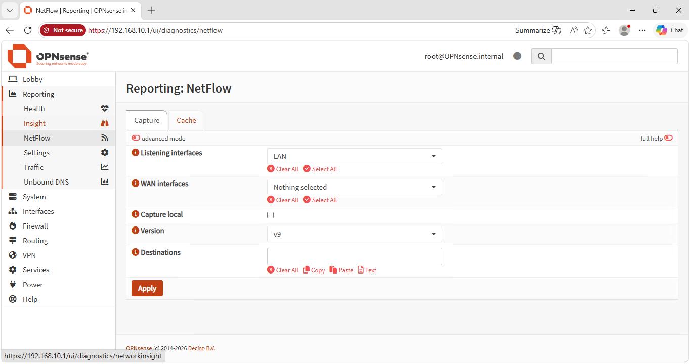

Shows NetFlow configured on the LAN interface in OPNsense.

### 2. Traffic Graph
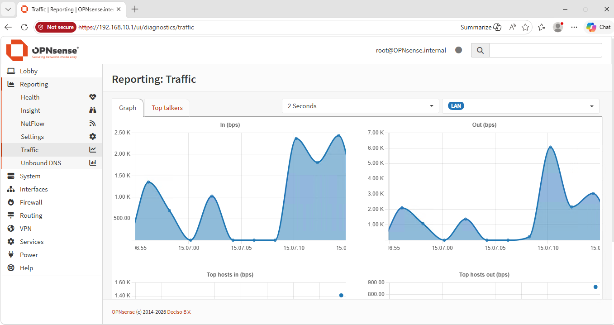

Shows live traffic activity collected from the LAN interface.

### 3. Top Talkers
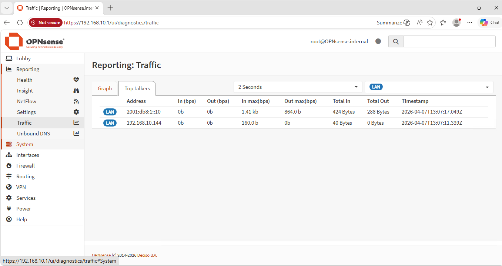

Shows active hosts detected during traffic monitoring.

### 4. IDS Settings
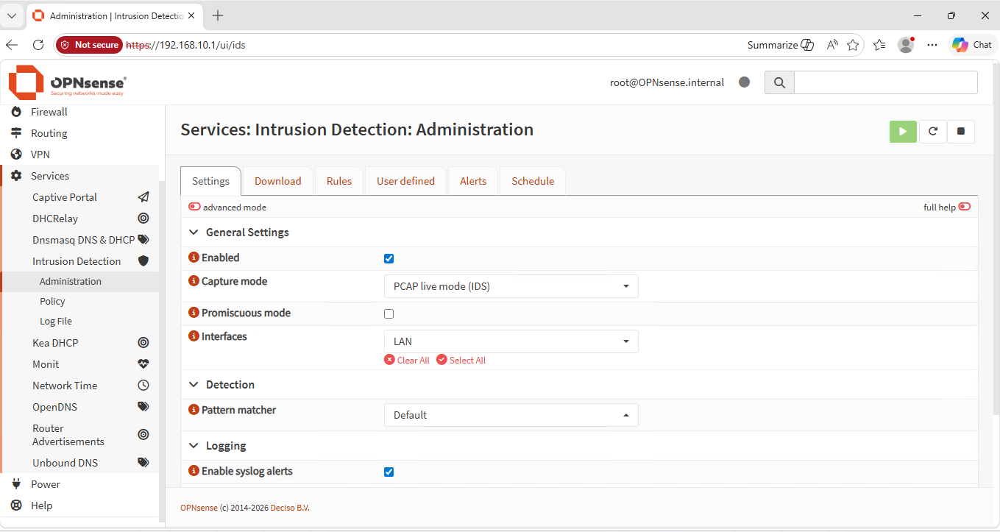

Shows Intrusion Detection enabled in PCAP live mode on the LAN interface.

### 5. IDS Rules
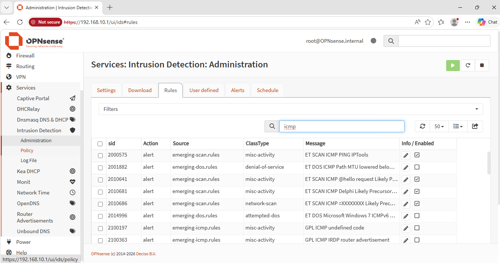

Shows IDS rules available in the selected rule set.

### 6. IDS Policy
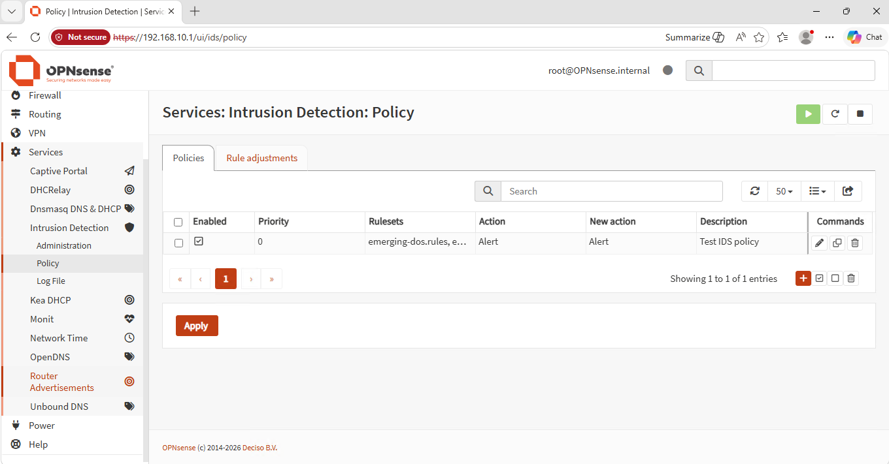

Shows the active IDS policy used during testing.

### 7. User Defined Rule
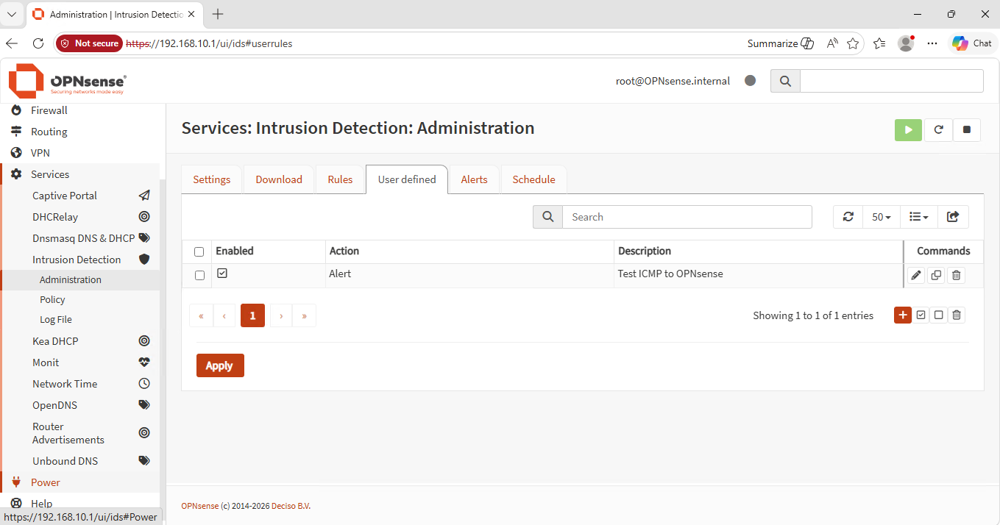

Shows the custom test rule created to verify IDS alert generation.

### 8. IDS Alert
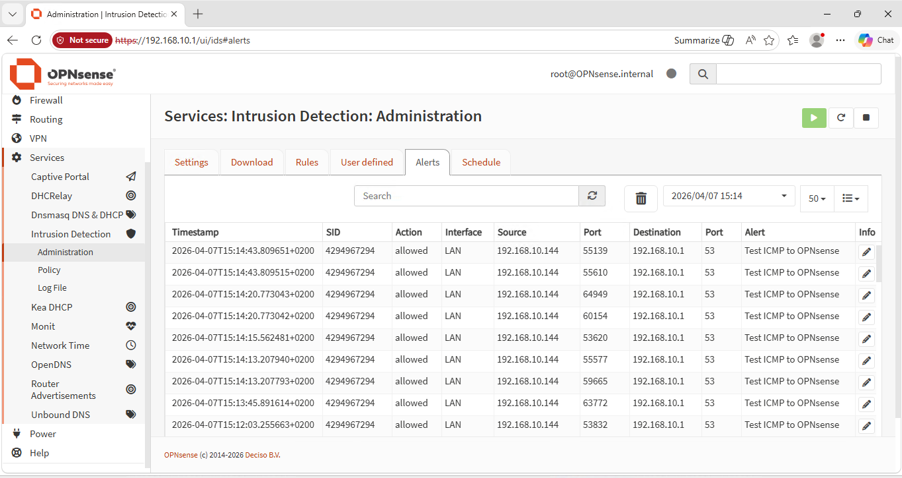

Shows the alert generated after sending test traffic to OPNsense.

### 9. Suricata Log
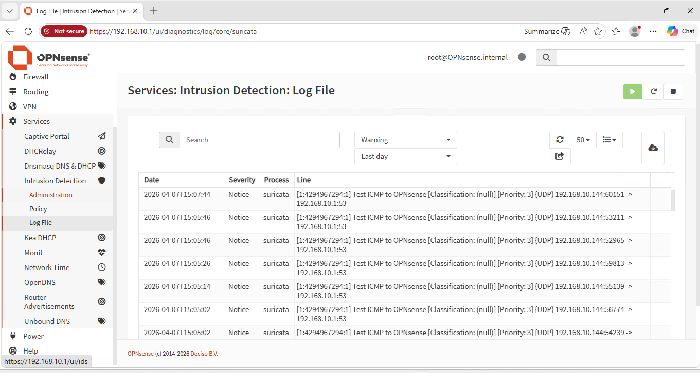

Shows the logged IDS event in the Suricata log file.

### 10. Ping Test to OPNsense
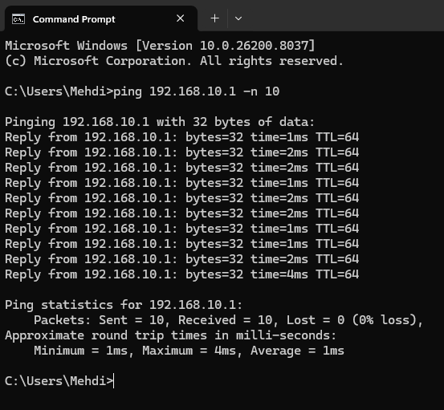

Shows a verification ping from Windows 11 to OPNsense.

### 11. Increased Traffic Test
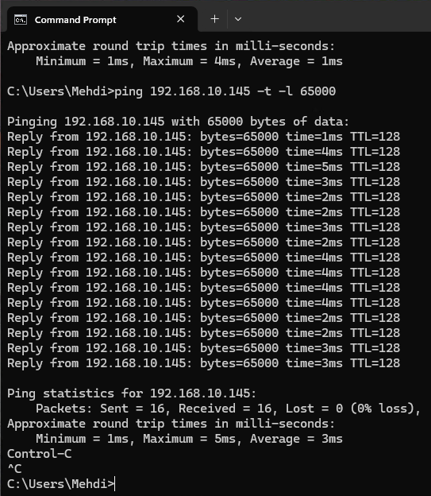

Shows the larger ICMP traffic test sent from Windows 11 to the Windows Server.

---

## Documentation

Detailed step-by-step guide is available in:

`docs/lab-documentation.md`

Includes:

- Lab preparation
- NetFlow setup
- Baseline traffic testing
- Increased traffic testing
- IDS configuration
- Controlled alert verification
- Troubleshooting
- Validation and analysis

---

## What I Learned

- How to configure and use NetFlow in OPNsense for traffic monitoring
- How to observe baseline traffic and compare it with increased traffic
- How to use Traffic Graph and Top Talkers for quick analysis
- Why traffic inside the same subnet may not behave as expected for firewall and IDS testing
- How to verify IDS functionality with a controlled user defined rule
- How to confirm IDS events in the Suricata log

---

## Key Skills Demonstrated

- OPNsense configuration
- NetFlow and traffic analysis
- IDS setup and verification
- Hyper-V network troubleshooting
- Traffic pattern observation
- Security testing and validation
- Technical documentation

---

## Author

Muhammad Mehdi  
IT Security Developer Student
